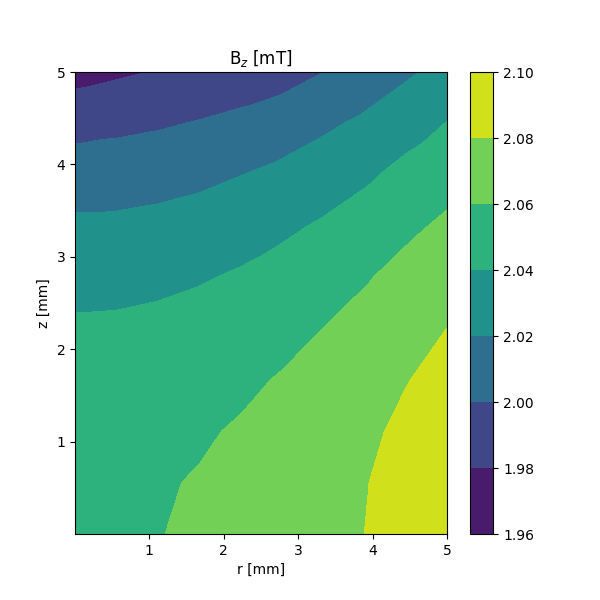
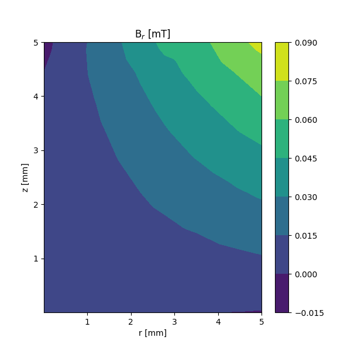
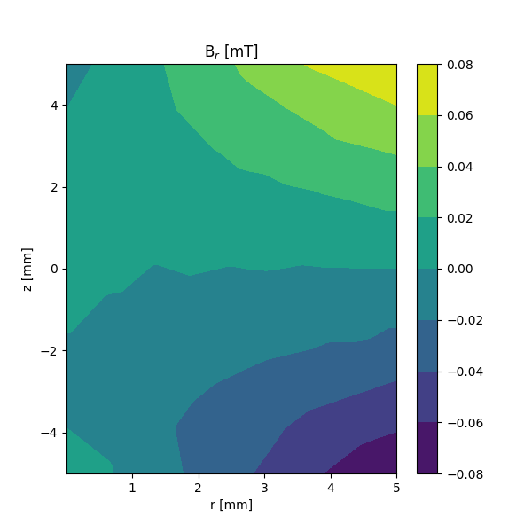

# Distributed winding coil

> Di Barba, P.; Mognaschi, M.E.; Lowther, D.A.; Sykulski, J.K.  A benchmark TEAM
> problem for multi-objective Pareto optimization of electromagnetic
> devices. IEEE Transactions on Magnetics, 2018, 54, 1–4.

## Problem description
In this example we compute the uniformity of the magnetic field produced by a
distributed winding. The problem can be solved both in symmetrical and
asymmetrical manner.  The coil has 20 turns, each with 1 mm x 1.5mm dimension
and 3A excitation. The region [0 mm, 5 mm] x [-5 mm , 5 mm] is called the
control region and we measure the radial and tangential components of the
magnetic flux density within this area. Each turn in the winding has a
particular distance from the z axis. These distances are the input of the model.
After the computation we plot the results in a 2D contour plot.

## Model creation
We create 2 distinct models for the problem: a symmetric and an asymmetric. We
begin with the latter. There are more than one ways to create a model for a
problem, but the simplest one is to just use the built in `BaseModel` class.
This class implements most of the boilerplate code that is needed for the
calculations. It sets up the proper paths and automatically builds, executes and
retrives the results. The users only required to fill the provided abstract
methods to get a fully functional model. If you are not familiar with the
`BaseModel` class, we suggest to take a look at
[this](../../digital-twin-distiller/basemodel.md) section of the documentation.


## Asymmetric case

Let's begin the model creation with subclassing the `BaseModel` class. To use
this class we have to fill the highlighted methods. The class will have 1 input,
which is the `X` list that holds the distance from the z axis for the different
turns. Since we simulate the full geometry, a 20 element list is
needed.

``` python hl_lines="18 21 24 27 30"

class SymmetircModel(BaseModel):
    def __init__(self, X:list, exportname=None):
        # check for proper length
        assert len(X) == 20

        # Be aware of mutable arguments !
        # Use the copy of the argument to prevent bugs.
        self.X = X.copy()

        # call the base class constructor to set up paths
        super(SymmetircModel, self).__init__(exportname=exportname)

        # if you want to use different paths then your changes go here

        # create the directories
        self._init_directories()

    def setup_solver(self):
        ...

    def define_boundary_conditions(self):
        ...

    def define_materials(self):
        ...

    def add_postprocessing(self):
        ...

    def build_geometry(self):
        ...
```

### Solver setup

The next step is to set up a FEM solver. Since there will be no exotic boundary
conditions you can use either Agros2D or FEMM. In this example we provide a
setup for both of the softwares and you can chose between them by changing the
highlighted line.

```python hl_lines="42"

    def setup_solver(self):

        # FEMM
        # create a metadata object
        femm_metadata = FemmMetadata()

        # set the problem type to magnetic
        femm_metadata.problem_type = "magnetic"

        # set the coordinate system to axisymmetric
        femm_metadata.coordinate_type = "axisymmetric"

        # use the generated filename as solver script
        femm_metadata.file_script_name = self.file_solver_script

        # use the generated filename as the solution filename
        femm_metadata.file_metrics_name = self.file_solution

        # set the unit for the geometry
        femm_metadata.unit = "millimeters"

        # turn off the smartmesh function
        femm_metadata.smartmesh = False

        # initialize the femm platform with this metadata object
        platform_femm = Femm(femm_metadata)

        # Agros2D
        agros_metadata = Agros2DMetadata()
        agros_metadata.file_script_name = self.file_solver_script
        agros_metadata.file_metrics_name = self.file_solution
        agros_metadata.problem_type = "magnetic"
        agros_metadata.coordinate_type = "axisymmetric"
        agros_metadata.analysis_type = "steadystate"
        agros_metadata.unit = 1e-3
        agros_metadata.nb_refinements = 0
        agros_metadata.adaptivity = "hp-adaptivity"
        agros_metadata.adaptivity_tol = 1
        platform_agros = Agros2D(agros_metadata)

        # select a platform to solve the problem
        platform = platform_agros

        # initialize the snapshot object with the chosen platform
        self.snapshot = Snapshot(platform)
```

### Boundary conditions

The next step is to define and add boundary conditions to the problem. Since
this is an asymmetric problem we have only 1 boundary condition on the outer
boundary of the problem.

``` python
    def define_boundary_conditions(self):
        # Create a homogenous Dirichlet boundary condition
        b1 = DirichletBoundaryCondition(name="a0",
                                        field_type='magnetic',
                                        magnetic_potential=0.0)

        # Add the boundary condition to the snapshot
        self.snapshot.add_boundary_condition(b1)

        # assign the outer lines as "a0" boundary.
        self.boundary_queue.append((0, 0, "a0"))
        self.boundary_queue.append((0, -20, "a0"))
        self.boundary_queue.append((0, 20, "a0"))

        self.boundary_queue.append((70, 70, "a0"))
        self.boundary_queue.append((70, -70, "a0"))
        self.boundary_queue.append((140, 0, "a0"))
```

### Materials

Similarly to the previous step, now we define the materials for the problem.
There are only 3 materials: `air`, `control` and `exctitation`. `air` and
`control` have default magnetic properties, while the `exctitation` has the
current density of 2e6 A/m2.

!!! note
    When setting up current densities for a material, always use A/m2.

``` python
    def define_materials(self):
        # creating the material for the turns
        exctitation = Material("J+")
        exctitation.Je = 2e6
        # if you want to use different meshsize in FEMM for this region
        # then uncomment this line
        # exctitation.meshsize = 1

        air = Material("air")
        # air.meshsize = 0.7

        control = Material("control")
        # control.meshsize = 0.1


        # Add the materials to the snapshot
        self.snapshot.add_material(exctitation)
        self.snapshot.add_material(air)
        self.snapshot.add_material(control)


        # Assign 2 labels for the stationary surfaces.
        self.label_queue.append((3, 0, "control"))
        self.label_queue.append((30, 30, "air"))
```

### Geometry
This problem has a relatievly simple geometry, but we are going to build it from
different pieces that are in svg files.


To load a file we have to use the `ModelPiece` class. This class can load
geometries from dxf or svg files and can be modified. You can translate, rotate
or mirror. If you want to use the same geometry multiple times, then just use
the `spawn()` method on a `ModelPiece` instance.

``` python

    def build_geometry(self):
        # Create a ModelPiece object for the outer boundary
        mp_bound = ModelPiece("bound")

        # load the geometry from the svg file
        # this piece is a simple rectangle with
        # the dimension: 140 mm x 140 mm
        mp_bound.load_piece_from_svg(self.dir_resources / "problem_boundary.svg")

        # move the geometry such that its lower left corner will touch the
        # (0, -70) point
        mp_bound.put(0, -70)

        # Create a ModelPiece object for the control region
        mp_control = ModelPiece("core")
        mp_control.load_piece_from_svg(self.dir_resources / "core_all.svg")
        mp_control.put(0, -5)

        # Create a ModelPiece object for the coil turns
        mp_coil = ModelPiece("coil")
        mp_coil.load_piece_from_svg(self.dir_resources / "coil.svg")

        # How many turns we have
        N = len(self.X)

        # The dimension of 1 turn (mm)
        h = 1.5 # height
        w = 1.0 # width

        # Add the outer region and the control zone to the geom variable
        # NOTE: do not merge the coil geometry yet.
        self.geom.merge_geometry(mp_bound.geom)
        self.geom.merge_geometry(mp_control.geom)

        # This is a coil turn factory
        # Copy the existing coil piece and move to the appropirate location
        for i, ri in enumerate(self.X):
            # Copy the existing coil
            coil = mp_coil.spawn()

            # compute the offset in the z direction
            offsetz = i * h - N * h / 2

            # move the coil to its place
            coil.put(ri, offsetz)

            # merge this piece into the geometry
            self.geom.merge_geometry(coil.geom)

            # add the excitation label for this coil
            self.label_queue.append((ri + w / 2, offsetz + h / 2, "J+"))

        # compute the line intersections
        # FEMM handles this automatically but Agros2D doesn't.
        self.geom.generate_intersections()

        # After the geometry is fully built, we merge it into the snapshot
        self.snapshot.add_geometry(self.geom)
```

### Postprocessing

Finally we add the postprocessing steps. Based on the problem definition, we
need the magnetic flux density values measured in a grid. To do this we create 1
array for the x coordinates and 1 array for the y coordinates, then we call a
numpy function to make a grid based on these 2 arrays. After this, we iterate
over the grid and append a postprocessing step to the `snapshot` variable.

``` python

    def add_postprocessing(self):

        # number of points in the r direction
        Nx = 10
        # number of points in the z direction
        Ny = 10

        # point arrays
        px = np.linspace(0.001, 5, Nx)
        py = np.linspace(-5, 5, Ny)

        # creating the grid
        xv, yv = np.meshgrid(px, py, sparse=False, indexing="xy")

        # iterate over the grid
        for i in range(Nx):
            for j in range(Ny):
                # We want the radial and the tangential components of the
                # magnetic flux density in each evaluation point.
                eval_point = (xv[j, i], yv[j, i])
                self.snapshot.add_postprocessing("point_value", eval_point, "Bz")
                self.snapshot.add_postprocessing("point_value", eval_point, "Br")

        # Lastly we want information about the mesh
        self.snapshot.add_postprocessing("mesh_info", None, None)
```

## Symmetric case
In the symmetric case we simulate only half of the problem. The model will be
very similar to the previous one, therefore we only list the differences.

### Boundary conditions
There is a new Neumann type boundary condition on the $z=0$ line (purple). This line
contains 4 line segments and we have to specify 4 points near to them to assign this boundary
condition. Any point is sufficient that is close enough to these lines, but
calculating their center point is much easier.


``` python hl_lines="7-9 13 15-18 20-24 26-33"
    def define_boundary_conditions(self):
        # Create a homogenous Dirichlet boundary condition
        b1 = DirichletBoundaryCondition(name="a0",
                                        field_type='magnetic',
                                        magnetic_potential=0.0)

        n0 = NeumannBoundaryCondition(name="n0",
                                      field_type='magnetic',
                                      surface_current=0.0)

        # Add the boundary condition to the snapshot
        self.snapshot.add_boundary_condition(b1)
        self.snapshot.add_boundary_condition(n0)

        self.boundary_queue.append((0, 2.5, "a0"))
        self.boundary_queue.append((0, 25, "a0"))
        self.boundary_queue.append((40, 140, "a0"))
        self.boundary_queue.append((140, 40, "a0"))

        x0 = 0
        x1 = 5
        x2 = self.X[0]
        x3 = x2 + 1.0
        x4 = 140

        p0 = ((x0 + x1) / 2, 0.0)
        p1 = ((x1 + x2) / 2, 0.0)
        p2 = ((x2 + x3) / 2, 0.0)
        p3 = ((x3 + x4) / 2, 0.0)
        self.boundary_queue.append((p0[0], p1[0], "n0"))
        self.boundary_queue.append((p1[0], p1[1], "n0"))
        self.boundary_queue.append((p2[0], p2[1], "n0"))
        self.boundary_queue.append((p3[0], p3[1], "n0"))
```

### Geometry
In the symmetric case the outer boundy is placed at the (0, 0) point, and only
half of the control region is needed. Only 10 turns are used and their place
is going to be different.

``` python hl_lines="4 8 22"
    def build_geometry(self):
        mp_bound = ModelPiece("bound")
        mp_bound.load_piece_from_svg(self.dir_resources / "problem_boundary.svg")
        mp_bound.put(0, 0)

        mp_control = ModelPiece("core")
        mp_control.load_piece_from_svg(self.dir_resources / "core_half.svg")
        mp_control.put(0, 0)

        mp_coil = ModelPiece("coil")
        mp_coil.load_piece_from_svg(self.dir_resources / "coil.svg")


        N = len(self.X) # 10 instead of 20
        h = 1.5
        w = 1.0
        self.geom.merge_geometry(mp_bound.geom)
        self.geom.merge_geometry(mp_control.geom)

        for i, ri in enumerate(self.X):
            coil = mp_coil.spawn()
            offsetz = i * h
            coil.put(ri, offsetz)
            self.geom.merge_geometry(coil.geom)
            self.label_queue.append((ri + w / 2, offsetz + h / 2, "J+"))

        self.geom.generate_intersections()
        self.geom.export_svg(self.dir_export/'geom.svg')

```

### Postprocessing
The only difference in the postprocessing is the grids range.
```python hl_lines="5"

    def add_postprocessing(self):
        # ...

        px = np.linspace(0.001, 5, Nx)
        py = np.linspace(0.001, 5, Ny)
        xv, yv = np.meshgrid(px, py, sparse=False, indexing="xy")

        # ...
```

## Simulation
To simulate the problem let's create an input first:
``` python
X = [10.0] * 10
```
In this case, all turns have a distance of 10 mm from the $z$ axis. We
instantiate a symmetric variant:
``` python
model = SymmetircModel(X)
```
By calling the `model` object we execute the calculation, then we save the
results in a variable. Since we don't need the solver scripts and other files,
we can set the `cleanup` flag to `True`.
``` python
result = model(cleanup=True)
```

`result` is a python dictionary that holds the variables we
assigned in the postprocessing steps. In this case:
``` py
>>> result.keys()
>>> dict_keys(['Bz', 'Br', 'dofs', 'nodes', 'elements])
```

'Br' and 'Bz' are lists of 3 element tuples, where each element has the format:
```
(x, y, B(x, y))
```
Let's extract the coordinates firtst:

``` python
x = [pointvalue[0] * 1000 for pointvalue in res["Br"]]  # [x, y, Br(x, y)]
y = [pointvalue[1] * 1000 for pointvalue in res["Br"]]  # [x, y, Br(x, y)]
```
Then extract the components of the magnetic flux density:
```python
Bz = [pointvalue[2] * 1000 for pointvalue in result["Bz"]]  # [x, y, Bz(x, y)]
Br = [pointvalue[2] * 1000 for pointvalue in result["Br"]]  # [x, y, Br(x, y)]
```
!!! note
    In the extractions, there is a `1000` scaler. This scaler is used to change the
    units from m to mm and from T to mT.

In order to create a nice contour plot, we have to interpolate the measured
values on a finer grid:

``` python
x_fine = np.linspace(min(x), max(x), 200)
y_fine = np.linspace(min(y), max(y), 200)
```

Interpolate the values on this 2 lists:

```python
Bz_fine = griddata((x, y), Bz, (x_fine[None, :], y_fine[:, None]), method='linear')
Br_fine = griddata((x, y), Br, (x_fine[None, :], y_fine[:, None]), method='linear')
```
Finally create the contour plots. One for the $z$ component:
``` python
plt.figure(figsize=(6, 6))
plt.contourf(x_fine, y_fine, Bz_fine)
plt.xlabel('r [mm]')
plt.ylabel('z [mm]')
plt.title(r'B$_z$ [mT]')
plt.colorbar()
plt.show()
```


And one for the $r$ component:
``` python

plt.figure(figsize=(6, 6))
plt.contourf(x_fine, y_fine, Br_fine)
plt.xlabel('r [mm]')
plt.ylabel('z [mm]')
plt.title(r'B$_r$ [mT]')
plt.colorbar()
plt.show()
```




The same results but with an asymmetric model:


