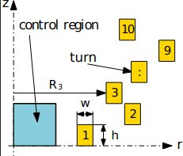

# Problem description

In this example we compute the uniformity of the magnetic field produced by a distributed winding.



*Fig 1: 2D model from the coil geometry and the design variables*

This deals with a seemingly simple problem, where the radius of a given number of circular turns should be optimized
that would generate a uniform magnetic field in the prescribed region. The task is to get a region *(control region in Fig. 1)* with a highly uniform magnetic field distribution. This magnetic
field is generated by a prescribed number (N = 10) of massive circular turns of rectangular cross-section *(yellow color
in Fig. 1)*.

The dimensions of the turns and the variation of their positions in the z-direction are fixed. The coil has 10 turns, each with 1 mm x 1.5mm dimension and 3A excitation. The region [0 mm, 5 mm] x [-5 mm , 5 mm] is
called the control region, and we measure the radial and tangential components of the magnetic flux density within this
area.

Each turn in the winding has a particular distance from the z axis. This is the inner radius of the turns (radii) which
can be varied from 5 mm to 50 mm in the r-direction. These distances are the [input of the model](#x-input variable), so ten unknown radii (design variables)
are to be identified.

After the computation we plot the results in a 2D contour plot.

**Parameters summary**

| Parameter                                                              | Value                         |
|------------------------------------------------------------------------|-------------------------------|
| Control region                                                         | [0 mm, 5 mm] x [-5 mm , 5 mm] |
| Number of turns                                                        | 10                            |
| Turn's dimension height (h)                                            | 1.5 mm                        |
| Turn's dimension width (w)                                             | 1mm                           |
| Turn's excitation                                                      | 3A                            |
| Radii (turns distance from z axis) R1,..., Ri,...,R10 of the ten turns | variation range is 5≤Ri≤50 mm |


**The $`F_1`$ function**

The goal function for single-objective problem is to design the geometry of coils that minimize discrepancy between the prescribed valued
$`\vec{B}_0`$ and actual distribution of $`\vec{B}`$
in the region of interest.

```math
F_1(r) = \sup_{q=1,n_{\rm p}} |\vec{B}(r_q,z_q)-\vec{B}_0(r_q,z_q)|,
```

where $`B_0(r_q,z_q) = (0, 2\,{\rm mT})`$ is the prescribed value of magnetic flux density and
$`n_{\rm p}`$ is the number of points.
